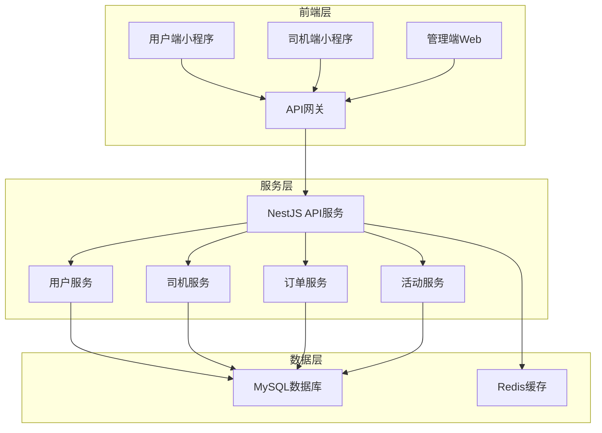

# 出租车电召系统部署指南

## 系统架构



## 环境要求

### 服务器配置（阿里云推荐）
- **ECS实例**: 2核4GB内存，40GB SSD云盘
- **操作系统**: CentOS 7.9 64位
- **带宽**: 5Mbps
- **地域**: 选择用户所在地区

### 软件环境
- **Node.js**: 18.x 或更高版本
- **MySQL**: 8.0.x
- **Redis**: 6.x
- **Nginx**: 1.20.x
- **PM2**: 进程管理器

## 部署步骤

### 1. 服务器初始化

```bash
# 更新系统
sudo yum update -y

# 安装基础工具
sudo yum install -y git vim wget curl unzip

# 安装Node.js
curl -fsSL https://rpm.nodesource.com/setup_18.x | sudo bash -
sudo yum install -y nodejs

# 验证安装
node -v
npm -v
```

### 2. 安装MySQL

```bash
# 下载并安装MySQL 8.0
wget https://dev.mysql.com/get/mysql80-community-release-el7-5.noarch.rpm
sudo rpm -ivh mysql80-community-release-el7-5.noarch.rpm
sudo yum install -y mysql-community-server

# 启动MySQL
sudo systemctl start mysqld
sudo systemctl enable mysqld

# 获取临时密码
sudo grep 'temporary password' /var/log/mysqld.log

# 安全配置
sudo mysql_secure_installation
```

### 3. 安装Redis

```bash
# 安装Redis
sudo yum install -y epel-release
sudo yum install -y redis

# 启动Redis
sudo systemctl start redis
sudo systemctl enable redis

# 配置Redis
sudo vim /etc/redis.conf
# 设置密码: requirepass your_redis_password

# 重启Redis
sudo systemctl restart redis
```

### 4. 安装Nginx

```bash
# 安装Nginx
sudo yum install -y nginx

# 启动Nginx
sudo systemctl start nginx
sudo systemctl enable nginx

# 配置防火墙
sudo firewall-cmd --permanent --add-service=http
sudo firewall-cmd --permanent --add-service=https
sudo firewall-cmd --reload
```

### 5. 项目部署

```bash
# 创建项目目录
sudo mkdir -p /var/www/taxi-api
cd /var/www/taxi-api

# 克隆项目（或上传代码）
git clone https://github.com/your-username/taxi-api.git .

# 安装依赖
npm install

# 安装PM2
npm install -g pm2

# 创建环境变量文件
cp .env.example .env
vim .env
```

### 6. 数据库配置

```bash
# 登录MySQL
mysql -u root -p

# 创建数据库和用户
CREATE DATABASE taxi CHARACTER SET utf8mb4 COLLATE utf8mb4_unicode_ci;
CREATE USER 'taxi'@'localhost' IDENTIFIED BY 'taxi123456';
GRANT ALL PRIVILEGES ON taxi.* TO 'taxi'@'localhost';
FLUSH PRIVILEGES;

# 导入数据
USE taxi;
source /var/www/taxi-api/database/init.sql;
```

### 7. 应用配置

编辑环境变量文件 `.env`：

```bash
# 服务器配置
PORT=3000
NODE_ENV=production

# 数据库配置
DB_HOST=127.0.0.1
DB_PORT=3306
DB_USER=taxi
DB_PASS=taxi123456
DB_NAME=taxi

# Redis配置
REDIS_HOST=127.0.0.1
REDIS_PORT=6379

# JWT配置
JWT_SECRET=your-production-secret-key

# 文件上传配置
UPLOAD_PATH=/var/www/uploads
MAX_FILE_SIZE=10485760
```

### 8. 启动应用

```bash
# 构建项目
npm run build

# 使用PM2启动
pm2 start ecosystem.config.js

# 保存PM2配置
pm2 save

# 设置开机自启
pm2 startup
sudo env PATH=$PATH:/usr/bin pm2 startup systemd -u www-data --hp /home/www-data
```

### 9. Nginx配置

创建Nginx配置文件 `/etc/nginx/conf.d/taxi-api.conf`：

```nginx
server {
    listen 80;
    server_name api.your-domain.com;
    
    # 文件上传大小限制
    client_max_body_size 20M;
    
    # API代理
    location / {
        proxy_pass http://127.0.0.1:3000;
        proxy_http_version 1.1;
        proxy_set_header Upgrade $http_upgrade;
        proxy_set_header Connection 'upgrade';
        proxy_set_header Host $host;
        proxy_set_header X-Real-IP $remote_addr;
        proxy_set_header X-Forwarded-For $proxy_add_x_forwarded_for;
        proxy_set_header X-Forwarded-Proto $scheme;
        proxy_cache_bypass $http_upgrade;
        
        # 超时设置
        proxy_connect_timeout 60s;
        proxy_send_timeout 60s;
        proxy_read_timeout 60s;
    }
    
    # 文件上传路径
    location /uploads/ {
        alias /var/www/uploads/;
        expires 30d;
        add_header Cache-Control "public, immutable";
    }
    
    # 健康检查
    location /health {
        access_log off;
        return 200 "healthy\n";
        add_header Content-Type text/plain;
    }
}
```

检查Nginx配置并重启：

```bash
sudo nginx -t
sudo systemctl reload nginx
```

### 10. SSL证书配置（HTTPS）

```bash
# 安装Certbot
sudo yum install -y certbot python3-certbot-nginx

# 获取证书
sudo certbot --nginx -d api.your-domain.com

# 自动续期
sudo crontab -e
# 添加：0 0,12 * * * python -c 'import random; import time; time.sleep(random.random() * 3600)' && certbot renew -q
```

## 监控和维护

### 1. PM2监控

```bash
# 查看应用状态
pm2 status

# 查看日志
pm2 logs taxi-api

# 重启应用
pm2 restart taxi-api

# 停止应用
pm2 stop taxi-api
```

### 2. 系统监控

```bash
# 安装htop
sudo yum install -y htop

# 查看系统资源
htop

# 查看磁盘空间
df -h

# 查看内存使用
free -h
```

### 3. 日志管理

```bash
# 应用日志
tail -f /var/www/taxi-api/logs/app.log

# Nginx访问日志
tail -f /var/log/nginx/access.log

# Nginx错误日志
tail -f /var/log/nginx/error.log

# MySQL慢查询日志
tail -f /var/log/mysqld-slow.log
```

## 备份策略

### 1. 数据库备份

创建备份脚本 `/var/backup/db-backup.sh`：

```bash
#!/bin/bash
DATE=$(date +%Y%m%d_%H%M%S)
BACKUP_DIR="/var/backup/mysql"
DB_NAME="taxi"
DB_USER="taxi"
DB_PASS="taxi123456"

mkdir -p $BACKUP_DIR
mysqldump -u$DB_USER -p$DB_PASS $DB_NAME > $BACKUP_DIR/taxi_$DATE.sql

# 删除7天前的备份
find $BACKUP_DIR -name "taxi_*.sql" -mtime +7 -delete
```

设置定时任务：

```bash
# 每天凌晨2点备份
0 2 * * * /var/backup/db-backup.sh
```

### 2. 文件备份

```bash
# 备份上传文件
tar -czf /var/backup/uploads_$(date +%Y%m%d).tar.gz /var/www/uploads/
```

## 性能优化

### 1. MySQL优化

编辑 `/etc/my.cnf`：

```ini
[mysqld]
# 基本设置
max_connections = 200
max_user_connections = 180
wait_timeout = 28800
interactive_timeout = 28800

# 查询缓存
query_cache_size = 64M
query_cache_limit = 2M

# InnoDB设置
innodb_buffer_pool_size = 1G
innodb_log_file_size = 256M
innodb_flush_log_at_trx_commit = 2

# 慢查询日志
slow_query_log = 1
slow_query_log_file = /var/log/mysqld-slow.log
long_query_time = 2
```

### 2. Node.js优化

```javascript
// ecosystem.config.js
module.exports = {
  apps: [{
    name: 'taxi-api',
    script: 'dist/main.js',
    instances: 'max',
    exec_mode: 'cluster',
    env: {
      NODE_ENV: 'production',
      PORT: 3000
    },
    error_file: './logs/err.log',
    out_file: './logs/out.log',
    log_file: './logs/combined.log',
    time: true
  }]
};
```

## 安全设置

### 1. 防火墙配置

```bash
# 安装firewalld
sudo yum install -y firewalld
sudo systemctl start firewalld
sudo systemctl enable firewalld

# 开放端口
sudo firewall-cmd --permanent --add-port=22/tcp
sudo firewall-cmd --permanent --add-port=80/tcp
sudo firewall-cmd --permanent --add-port=443/tcp
sudo firewall-cmd --permanent --add-port=3000/tcp
sudo firewall-cmd --reload
```

### 2. 用户权限

```bash
# 创建应用用户
sudo useradd -m -s /bin/bash taxi
sudo passwd taxi

# 设置文件权限
sudo chown -R taxi:taxi /var/www/taxi-api
sudo chmod -R 755 /var/www/taxi-api
```

## 故障排查

### 常见问题

1. **应用无法启动**
   - 检查端口占用：`netstat -tulnp | grep 3000`
   - 查看日志：`pm2 logs`
   - 检查环境变量：`.env`文件

2. **数据库连接失败**
   - 检查MySQL状态：`systemctl status mysqld`
   - 检查用户权限：`mysql -u taxi -p`
   - 检查防火墙端口

3. **Nginx 502错误**
   - 检查应用是否运行：`pm2 status`
   - 检查Nginx配置：`nginx -t`
   - 检查端口监听：`netstat -tulnp | grep 3000`

## 更新部署

```bash
# 拉取最新代码
cd /var/www/taxi-api
git pull origin main

# 安装依赖
npm install

# 重新构建
npm run build

# 重启应用
pm2 restart taxi-api

# 检查状态
pm2 status
```

## 联系支持

如有问题，请联系技术支持：
- 邮箱：support@taxi.com
- 电话：400-123-4567