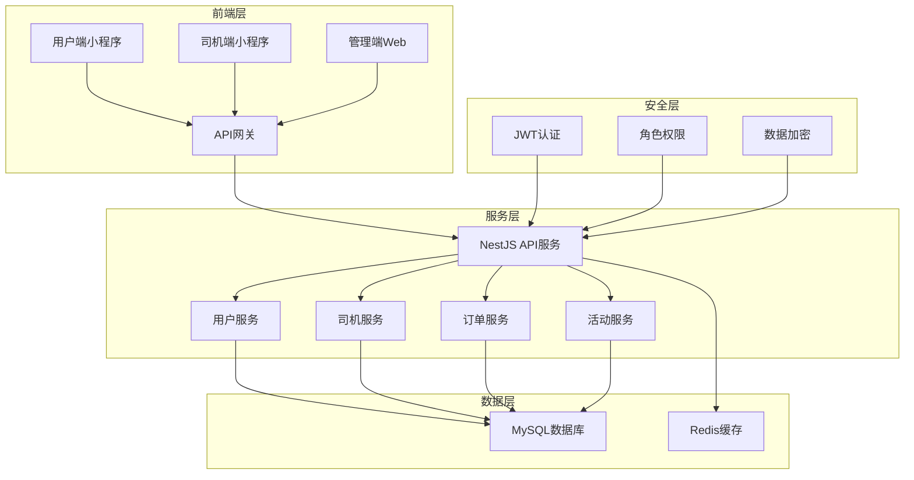
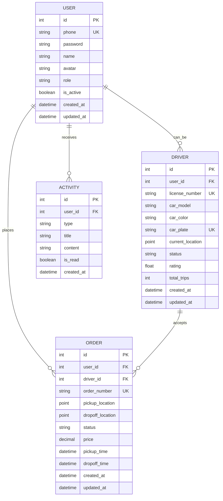

# 🚕 出租车电召系统后端API

一个基于NestJS开发的现代化出租车电召系统后端服务，支持用户叫车、司机接单、订单管理、实时定位等核心功能。

## 🎯 功能特性

### 用户端功能
- ✅ 用户注册与登录（JWT认证）
- ✅ 个人信息管理
- ✅ 发布订单（实时叫车/预约用车）
- ✅ 订单状态跟踪
- ✅ 司机位置实时查看
- ✅ 在线支付与评价
- ✅ 订单历史查询
- ✅ 消息通知

### 司机端功能
- ✅ 司机注册与认证
- ✅ 个人信息管理
- ✅ 实时位置更新
- ✅ 订单接收与处理
- ✅ 行程状态管理
- ✅ 收入统计
- ✅ 评分系统
- ✅ 消息通知

### 管理端功能
- ✅ 用户管理
- ✅ 司机管理
- ✅ 订单管理
- ✅ 数据统计
- ✅ 系统通知
- ✅ 活动管理

## 🏗️ 技术架构



## 🚀 快速开始

### 环境要求
- Node.js >= 18.0.0
- MySQL >= 8.0
- Redis >= 6.0

### 1. 安装依赖

```bash
npm install
```

### 2. 配置环境变量

```bash
cp .env.example .env
# 编辑 .env 文件，配置数据库和Redis连接信息
```

### 3. 数据库初始化

```bash
# 创建数据库
mysql -u root -p < database/init.sql

# 运行数据库迁移
npm run migration:run
```

### 4. 启动开发服务器

```bash
# 开发模式
npm run start:dev

# 生产模式
npm run build
npm run start:prod
```

服务启动后，API文档地址：http://localhost:3000/api

## 📁 项目结构

```
src/
├── common/               # 公共模块
│   ├── decorators/     # 自定义装饰器
│   ├── dto/           # 数据传输对象
│   ├── entities/      # 数据库实体
│   ├── enums/         # 枚举定义
│   ├── guards/        # 权限守卫
│   └── interceptors/  # 拦截器
├── modules/            # 业务模块
│   ├── user/          # 用户模块
│   ├── driver/        # 司机模块
│   ├── order/         # 订单模块
│   └── activity/      # 活动模块
├── config/             # 配置文件
└── main.ts            # 应用入口
```

## 🔐 API文档

### 认证机制
- 使用JWT (JSON Web Token) 进行身份认证
- 支持用户、司机、管理员三种角色
- Token有效期：7天

### 主要接口

#### 用户相关
- `POST /api/users/register` - 用户注册
- `POST /api/users/login` - 用户登录
- `GET /api/users/profile` - 获取用户信息
- `PUT /api/users/profile` - 更新用户信息

#### 司机相关
- `POST /api/drivers/register` - 司机注册
- `POST /api/drivers/login` - 司机登录
- `POST /api/drivers/location` - 更新位置
- `GET /api/drivers/nearby` - 获取附近司机

#### 订单相关
- `POST /api/orders` - 创建订单
- `GET /api/orders/:id` - 获取订单详情
- `PUT /api/orders/:id/status` - 更新订单状态
- `POST /api/orders/:id/pay` - 订单支付

## 🛠️ 部署指南

详细部署步骤请参考 [DEPLOYMENT.md](DEPLOYMENT.md)

### 快速部署（使用PM2）

```bash
# 安装PM2
npm install -g pm2

# 启动应用
pm2 start ecosystem.config.js

# 保存配置
pm2 save
pm2 startup
```

## 🔧 配置说明

### 环境变量

| 变量名 | 说明 | 默认值 |
|--------|------|--------|
| `PORT` | 服务端口 | 3000 |
| `DB_HOST` | 数据库主机 | localhost |
| `DB_PORT` | 数据库端口 | 3306 |
| `DB_USER` | 数据库用户 | root |
| `DB_PASS` | 数据库密码 | - |
| `DB_NAME` | 数据库名 | taxi |
| `JWT_SECRET` | JWT密钥 | - |
| `REDIS_HOST` | Redis主机 | localhost |
| `REDIS_PORT` | Redis端口 | 6379 |

## 📊 数据库设计

### 核心表结构



## 🧪 测试

```bash
# 单元测试
npm run test

# 测试覆盖率
npm run test:cov

# 端到端测试
npm run test:e2e
```

## 📈 性能优化

### 数据库优化
- 使用索引优化查询性能
- 合理设计表结构，避免数据冗余
- 使用连接池管理数据库连接

### 缓存策略
- Redis缓存热点数据
- JWT Token缓存验证
- 地理位置缓存

### 代码优化
- 使用集群模式充分利用多核CPU
- 合理设置PM2进程数
- 使用Gzip压缩响应数据

## 🔒 安全特性

- JWT Token认证
- 密码bcrypt加密
- 输入参数验证
- SQL注入防护
- CORS跨域控制
- 请求频率限制

## 📱 移动端支持

- RESTful API设计
- 支持微信小程序
- 支持支付宝小程序
- 响应式数据格式

## 🤝 贡献指南

1. Fork 项目
2. 创建特性分支 (`git checkout -b feature/amazing-feature`)
3. 提交更改 (`git commit -m 'Add some amazing feature'`)
4. 推送到分支 (`git push origin feature/amazing-feature`)
5. 创建 Pull Request

## 📝 许可证

本项目基于 [MIT License](LICENSE) 开源协议

## 🆘 支持

如遇到问题，请通过以下方式联系我们：
- 📧 邮箱：support@taxi.com
- 📱 电话：400-123-4567
- 💬 微信：taxi-support

## 🙏 致谢

感谢所有为这个项目做出贡献的开发者们！

---

**⭐ 如果这个项目对你有帮助，请给我们一个Star！**